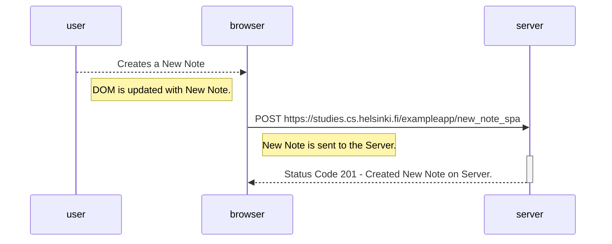

```mermaid
sequenceDiagram
    participant user
    participant browser
    participant server

    user-->>browser: Creates a New Note
    Note right of user: DOM is updated with New Note.

    browser->>server: POST https://studies.cs.helsinki.fi/exampleapp/new_note_spa
    Note right of browser: New Note is sent to the Server.
    activate server
    server-->>browser: Status Code 201 - Created New Note on Server.
    deactivate server
```
